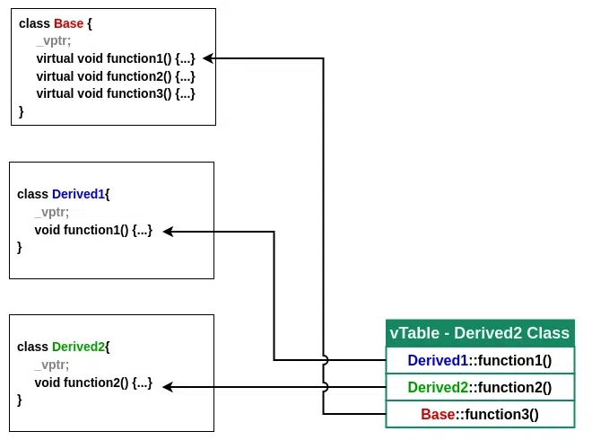
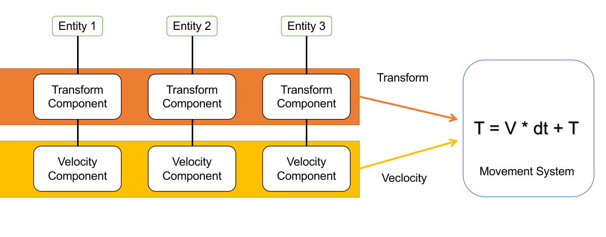
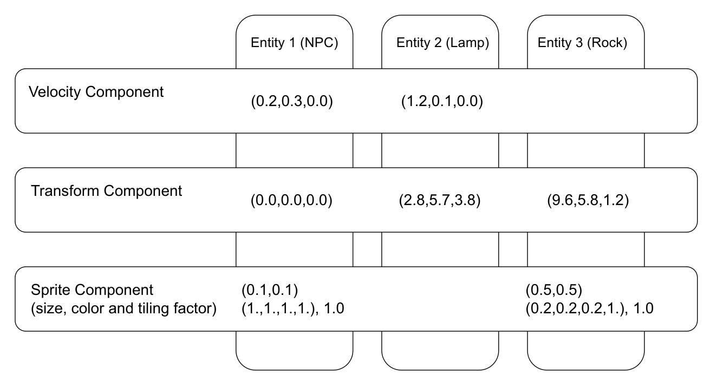
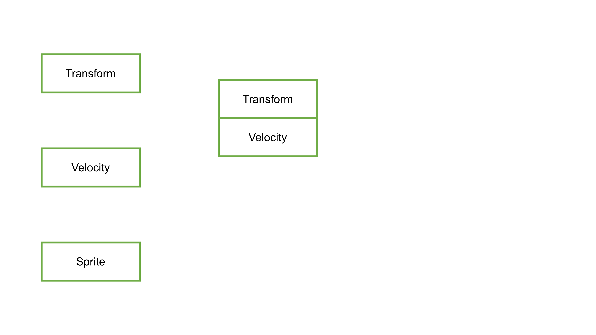
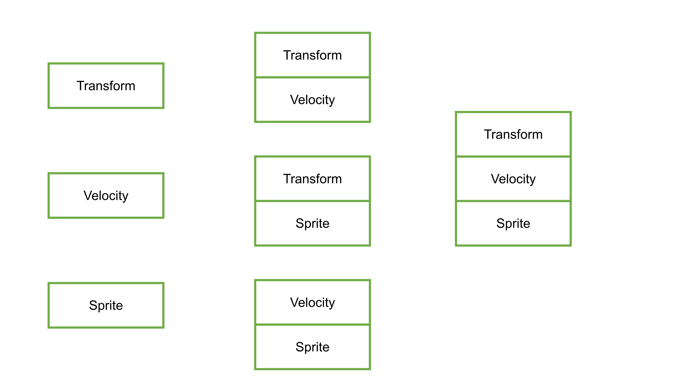

# (VERY EARLY DRAFT ONLY)

# Title: Unlocking Entity Component Systems in Game Engines: A Practical Approach to Core Mechanics

João Henrique Schmidt de Carvalho - 119050097

Advisor: Geraldo Xexeo

## Abstract

This work explores the integration of Entity Component System (ECS) and scripting into game engine development, with a focus on their roles in enhancing performance, maintainability, modularity and coding complexity. ECS provides a data-driven approach to managing game entities and behaviors, addressing challenges related to memory locality, polymorphism overhead, and parallelism. Scripting facilitates both dynamic and static interaction with the engine, through Lua and C++ respectivelly, allowing  greater accessibility when the ECS is unnecessary. This study analyzes ECS impact on core functionalities like graphics rendering and physics simulation. Key contributions include performance benchmarks, architectural insights, and practical guidelines for integrating ECS and scripting into game engines, with implications extending to simulation software and other performance-critical applications.

## 1. Introduction Scheme:

<!-- Problem presentation/Context -->

The creation of game engines is a complex task that involves integrating multiple systems, including graphics, physics, input handling, sound, events, camera, just to name a few. One of the main architectural design choice of most modern game engines is the presence of ECS, that isolates each of those tasks into "Systems". Those have access to all data from the game. 

ECS is a data-driven architecture, which forbades object methods and instead strips its data into engine components whenever possible. Alongside ECS, scripting plays a role when those components can't be separated, and also enable dynamic interaction with interpreted languages, such as Python, Lua, among others. Both ECS and scripting allow for complex and simple game design choices respectivelly, which is essential for handling modern games.

<!-- Objective -->

This TCC focuses on how these systems are built and their relationship with other engine components, mainly graphics and physics. The goal is to design and implement these systems within a game engine, providing a comparasion with OOP of their impact on maintainability and then performance. Additionally, this work will explore how ECS and scripting can potentially influence other core systems, demonstrating their importance in the overall architecture of game engines

<!-- Justification -->

The significance of this research lies in the growing need for modular and efficient game engines. ECS has become a widely adopted pattern in the industry due to its ability to handle large-scale projects by decoupling data from logic, id est, the entity-component from systems.

Scripting, meanwhile, allows game developers to still use OOP when necessary and, allow to quickly change gameplay without touching the engine code; With added bonus if the scripting languages is interpreted since it won't need to compile. In turn, also makes it easier to apply modifications by non-core developers. Understanding how scripting interact with the ECS Api can provide valuable insights for improving engine performance because they can decide when to pass script code into the engine code.

Meanwhile, even when not using such architecture, it can be helpful to know why. For example, Godot programers decided that, the extra maintainability created more disadvantages than the extra perfomance was worth it <cite>\[[7]\][7]</cite>. Therefore, it is a decision that must be made knowing its trade-offs

<!-- Objective 2 -->

First, I will talk about references and other essential tools used when building the ECS for a game engine or other big c-based projects in general.

Then I will research and define the core architecture of ECS, identifying how entities, components, and systems will interact within the engine. This includes designing the data structures and memory layout.

Follwoing that, I will briefly talk about two main sub-architectures

Next, I will show an implementation of ECS, the Registry and the Scene, the latter will act as a sort of API to manipulate complex data structures demonstrating.

Finally, I will conduct performance benchmarks and tests to evaluate the efficiency and scalability of the ECS in handling big scenes, showing some examples of its interaction with other engine systems.

By the end of this project, I expect to have contributed a functional ECS and scripting system within Pain-Engine, which is a game engine I'm building as a hobby, documenting how these systems either improve or challenge existing architectures developers job. This TCC will serve as a practical guide for developers looking to integrate ECS and scripting into their own projects, offering insights into the design choices, trade-offs, and challenges associated with these core desicions.

## 2. Important Theoretical frameworks

Computer Systems: A Programmer’s Perspective by Randal Bryant is sometimes called "The Computer Science Book" by some of my colleagues. This reference is key for understanding the lower-level assembly aspects of coding, which are critical when building high-performance and clean software. It covers topics like memory management, CPU architecture, instructions, unexpected behaviors and efficient code execution, all of which are relevant to optimizing queries inside ECS's systems, and their data structures.<cite>\[[1]\][1]</cite>

The detailed exploration of how instructions are decided by the compiler will help me make informed decisions when managing resources in the engine, ensuring that it remains both efficient and scalable. This book was be especially helpful in addressing challenges related to safety problems, as it provides insights into what problems.

Another aspect of this book is that it covers some unintuitive and invisible behaviors from the c programming language that can lead to bugs, even for advanced programmers. By doing so, it justifies some of the design choices that I'm using in my game engine.

The EnTT source code by skypjack. EnTT is a well-established and highly efficient C++ library for implementing a Sparse-Set Entity Component System (ECS). I chose to reference EnTT because it provides a already exhaustively tested ECS architecture that has been widely adopted in both hobbyist and professional game developments, like Minecraft, Crimson Rush, ArcGIS Runtime SDKs, etc<cite>\[[2]\][2]</cite>. I also choose because of his wonderful blog called "ECS back and forth" which goes in detail on what problems engines are usually trying to solve<cite>\[[8]\][8]</cite>. Studying EnTT's source code will expose some intersting ways on how to create functions to handle entities and components.

Its use of modern C++ techniques, like template meta-programming, will serve as a valuable guide for implementing similar strategies in my own Registry system. The library is also made with the intent of being very simple to use and to modify if necessary.

ECST is an experimental multithreaded compile-time ECS library. It was developed as a Computer Science graduation project. I chose to reference ECST for its interesting approach to compile-time and multithreaded designs. The library was made using c++14, but by studying ECST’s source code, one could gain knowledge to design an ECS that leverages modern c++20 architectures. <cite>\[[3]\][3]</cite

Lastly and perhaps the closest to the present article is Sander Mertens Flecs ECS library, and also exhaustively tested on numerous projects like Tempest Rising, Territory Control 2, Resistance is Brutal, etc <cite>\[[9]\][9]</cite>. Which is also complemented by the amazing blog series "Building and ECS". There, he disclosures what designs and principles were choosen during his making of Flecs<cite>\[[10]\][10]</cite>. Especially the main "Archetype" architecture, which differs from EnTT Sparse-Set.

<!-- Description:
Description of the problem: Object Centric Loops
Description of the problem: 3 problems of OOP flexibility
The remedy: Enhancing System Centric Loops
What is the most common solution (done)
What is the problem with the common solution (done)
Explaining the ECS solution
What are the Components, the Entities and the Systems
What is the Registry
What are the archetypes
How does Scripting work?
-->

## 3.1 Description of the problem: Object Centric Loops

There is no way around this subject other than to describe exactly what is being built here. As with any work, its purpose is to solve problems, or at least to solve it in a marginally better way than other existing solutions. To be more precise, there are 2 problems an ECS intends to solve for game engines: 

On the first problem, suppose that a developer is creating his/her game, and it needs to update millions of objects. Some of them are quite different from each other, so you have different structs of data.

For example, it might have objects like lights, meshes, audios, sprites, transforms, etc.

<!-- NOTE: this is pseudocode, "c" is here because i like highlight-->

```
CLASS Mesh EXTENDS Node
CLASS Light EXTENDS Node
CLASS Audio EXTENDS Node
CLASS Sprite EXTENDS Node
CLASS Transform EXTENDS Node
```

Most probably, the object will be a combination of those above:

```
CLASS MeshWithAudio EXTENDS Node 
    Mesh mesh
    Autio audio

CLASS LightWithAudio EXTENDS Node 
    Light mesh
    Autio audio

CLASS LightMeshWithAudio EXTENDS Node 
    Light light
    Mesh mesh
    Autio audio

CLASS CollisionWithMesh EXTENDS Node 
    Collider collider
    Mesh mesh
// etc
```

Or, if you language support multiple inheritance, you can do the following:

```
CLASS MeshWithAudio EXTENDS Mesh, Audio
CLASS LightWithAudio EXTENDS Light, Audio
CLASS LightMeshWithAudio EXTENDS Light, Mesh, Audio
CLASS CollisionWithMesh EXTENDS Collider, Mesh
```
Either way, using those primary objects, you would need to make it available for the developer, so it can be used on actual objects, e.g.:

```
CLASS Enemy EXTENDS ColliderWithhMeshWithAudio
CLASS Player EXTENDS ColliderWithhMeshWithAudio
CLASS Firefly EXTENDS LightWithAudio 
CLASS Lamp EXTENDS LightMeshWithAudio
CLASS Wall EXTENDS CollisionWithMesh
```

Therefore, you would need to define $2^N$ different classes, which is not feasable for higher values of $N$. Let's explore how Godot, which is an exclusively OOP engine, solve this problem inside their definiton of `Node` at `scene/main/node.h` <cite>\[[11]\][11]</cite>


<!-- 1. polymorphism overhead, 2. memory locality, 3. parallelizability-->
```cpp
class Node : public Object {
    struct Data {
        Node *parent = nullptr;
        Node *owner = nullptr;
        HashMap<StringName, Node *> children;
    };
    Data data;
};
```

Now, the problem is solved by using composition, without using multiple inheritance. From Godot perspective, you can place new components inside its children hashmap, and as long as it is inherited from Node, you will have your object as complex as necessary.

```cpp
Node enemy = new Node();
enemy.data.children.insert({"Mesh", new Mesh{}}, {"Audio", new Audio});
```
Now, if we were to add an interpreted language, we can expose a function such as  `insert_component` to add new components to objects inside the engine, without needing to recompile.

With that ready, the developer also needs to iterate between all those objects and update their data. Each object will have at least some sort of action in the game, for example, be rendered, collide, process events, move, change states, etc.

Those direct approaches are prone to create two specific code styles to fill those tasks: a vertical style that is object-centric (OC) and a more horizontal style that is system-centric (SC).

In the vertical style, each object is called and sequentially updated to perform specific tasks:

```
FOR EACH enemy IN Enemies
    CALL enemy.move
    CALL enemy.checkCollisions
    CALL enemy.render
    CALL enemy.searchPlayer
    // etc

FOR EACH player IN Players
    CALL player.move
    CALL player.checkCollisions
    CALL player.render
    CALL player.hideFromEnemy
    // etc

FOR EACH firefly IN Fireflies
    CALL firefly.move
    CALL firefly.emmit
    // etc
```

A little problem emerges: in this example, enemies executes first meaning it can move and collide with the player first. But, in another simulation, if player executes first, then it can run before getting hit.

Notice however, that many of those functions are performing the same task for many different objects. So in OOP, we can solve the problem by using interfaces to our advantage:

```
INTERFACE i_move IMPLEMENTS move
INTERFACE i_render IMPLEMENTS render
INTERFACE i_collidable IMPLEMENTS checkCollisions

CLASS Enemy IMPLEMENTS i_move, i_collidable, i_render
CLASS Player IMPLEMENTS i_move, i_collidable, i_render
CLASS Firefly IMPLEMENTS i_move

// ...later
FOR EACH movable IN movables
    CALL (i_move) movable.move
FOR EACH renderable IN renderables
    CALL (i_render) renderable.render
FOR EACH collider IN collidable
    CALL (i_collidable) collider.checkCollisions
```

Why is this necessary? Mainly because it can happen that one operation conceptually needs to happen for all objects before another operation begins. Now both player and enemy need to make their moves before checking their collision, solving that little problem.

This is a SC loop but not an ECS yet. This specific style, which is common in OOP, still has 3 performance issues.

## 3.2 Description of the problem: 3 problems of OOP flexibility 
<!-- 1. polymorphism overhead -->

The first one is polymorphism overhead. Dynamic polymorphism in typical OOP implementations commonly uses an indirect dispatch mechanism. Why? Because whenever you call a method of a base class or using interfaces, the call itself involves one indirect step before the actual code is reached, and this redirection creates the overhead. Its cost usually depends on implementation, $C++$ usually does this with the use of vTables, which are very straightforward indexed tables that links virtual functions to real functions.
But what is the overhead? At runtime the program needs to check inside the vTable what is the correct link between the virtual function and the actual function before performing the call. That extra step is what makes the program slow down<cite>\[[6]\][6]</cite>



*Figure 1: Example of vTable storing the linkage between two derived classes*

It's designed this way on purpose. For example, both enemies and fireflies implement a move function, but firefly function may not necessarly be the same as enemies since flies usually move on 3 axis, including up and down. Interfaces therefore, also allow you to modify the function bodies per class at the cost of a little memory and cpu.

<!-- 2. Memory locality -->

The second problem is the memory locality. In the ECS case, the data will always be stored into a data structure of your choice, like an array or a map. Since you have the option to store all data in a single pool, you might as well store on a contiguous section in your memory.  

However, when iterating in OOP, you are looping in the data of the entire object first before going to the next object. If such object has different members that arent't being used in the function, your instruction will have to skip them. 

It is possible to clearly see the cost by doing a simple test. E.g, writing a small loop to sum all elements of a matrix "A":

```pseudocode
INITIALIZE result TO 0
INITIALIZE A TO MATRIX(20000,20000)

FOR EACH i from 0 to A.rows - 1:
    FOR EACH j FROM 0 TO A.cols - 1:
        ADD A[i][j] TO result
```

When implemented in C, this code will execute in 1.78 seconds for a square matrix A of size $20000$
```pseudocode
INITIALIZE result TO 0
INITIALIZE A TO MATRIX(20000,20000)

FOR EACH j FROM 0 TO A.cols - 1:
    FOR EACH i from 0 to A.rows - 1:
        ADD A[i][j] TO result
```
When implemented in C, this code will execute in 2.23 seconds for a square matrix A of size $20000$, a 25% increase

<!-- creates full table here using `perf stat -e '{cache-references,cache-misses},{L1-dcache-loads,L1-dcache-load-misses},{LLC-loads,LLC-load-misses}' ./tcc/matrix_test/rowWise` -->

What is happening here? In the memory, the data for matrix A is stored in the following layout:

```
A[0][0], A[0][1], A[0][2], ..., A[0][N], A[1][0], ..., A[1][N], ..., A[N][N]
```

When the CPU reads memory, it generally does not fetch just the 4-byte float like we requested. It fetches a cache line, typically something like 64 bytes on modern CPUs. So, when requesting:

```
A[0][0], A[0][1], A[0][2], A[0][3], A[0][4], A[0][5], A[0][6], A[0][7], A[0][8], ...
```

The CPU can request the next number from his own cache instead of fecthing again.

If we choosen to not do it, we are essentially jumping $20000$ bytes of integers for every single iteration, and this increase the cache misses we see on perf command. In the end, this just shows what is already known, it is better for the CPU if the loops operates with arrays that are contiguous in memory.

With this we conclude the two disadvantages of not using an ECS style to deal with objects in a simulation.

However, there is a third, very indirect problem: which is the difficulty of implementing parallelism when compared to ECS... To be more precise, the work needed to parallelize ECS systems is smaller than OOP cases because of the restrictions it impose. 

I will talk more about this when discussing systems, but to make a brief introduction as to why: the main problem with parallelization is finding units of processing which don't share any data, but because data in ECSs often iterated is mostly with the same set of components, there is a guarantee that the data inside a single system is unrelated to each other, which allows easy concurrency. 

<!-- comparasions with cuda :
GPU programming	vs ECS
Kernel vs	System
Thread vs	Entity / query iteration
Global memory	vs Component storage
Thread block vs	Chunk / archetype
Grid vs	Entire query
Kernel dispatch	vs System execution
Kernel arguments vs	Query/resources
Synchronization	System vs ordering/dependencies
-->

## 4.1 ECS as remedy: System
 
The previous OOP SC loop also allows for further flexibility when it comes to completing engine tasks. For example:

```pseudocode
CLASS Firefly IMPLEMENTS i_move
  FUNCTION move OVERRIDE
    // move firefly ...

CLASS Enemy IMPLEMENTS i_move, i_collidable, i_render
  FUNCTION move OVERRIDE
    // move enemy ...
```

This is a useful flexibility to have, but it's also probable that the developer will implement some repeated calculation. For example, let's us suppose a very simple firefly would use the following:

```pseudocode
CLASS Firefly IMPLEMENTS i_move 
    position = (0,0)
    velocity = (0,0)
    timer = 0.0
    function getRandomNum()

    PUBLIC FUNCTION move(dt) OVERRIDE 
        timer -= dt

        // Choose random dir
        IF directionTimer <= 0.0f THEN
            velocity.x = CALL getRandomNum
            velocity.y = CALL getRandomNum
            timer = CALL getRandomNum

        // Apply velocity !
        position += velocity * dt
```
Similarly, a very simple enemy that just follows the player would also need to apply velocity:

```pseudocode
CLASS Enemy IMPLEMENTS i_move, i_collidable, i_render 
    position = (0,0)
    velocity = (0,0)
    speed = 1

    PUBLIC FUNCTION move(float dt) OVERRIDE
        direction = (0,0)

        // player dir
        direction = CALL pathToPlayer
        velocity = direction * speed;
        
        // Apply velocity !
        position += velocity * dt;
```

The existing of a SC loop is already known, and since they are both using the same Euler formula, the formula itself can be separated into its own system:

```pseudocode
FUNCTION applyVelocity(positions, velocities, dt)
    FOR EACH position, velocity IN positions, velocities
        position += velocity * dt
```

Doing so means the engine is running the behavior separately from the data, and this is correct. Systems are just code blocks that transform the data, each of them are functions that represent a specific logic, like applying velocity.

However a new problem emerges: when we try to create a system like `applyVelocity`, the underlying data isn't yet organized into convinient variables like `positions` and `velocities`. They are, instead, own by each object as member variables. 

The solution is to just to separate them, removing the ownership of their respective objects and instead putting in a contiguous block of memory. For example, suppose we have one firefly and one enemy:

```
velocities = [(0,0), (0,0)]
positions = [(0,0), (0,0)]
```

The system now has everything to work, meaning it can now be called and therefore, perform its tasks. However, we quickly need to compensate for removing the ownership on both objects:

```pseudocode
CLASS Firefly IMPLEMENTS i_move 
    column = 0
    timer = 0.0
    function getRandomNum()

    PUBLIC FUNCTION move(dt) OVERRIDE 
        velocity = velocities[column]
        timer -= dt

        // Choose random dir
        IF directionTimer <= 0.0f THEN
            velocity.x = CALL getRandomNum
            velocity.y = CALL getRandomNum
            timer = CALL getRandomNum
CLASS Enemy IMPLEMENTS i_move, i_collidable, i_render 
    column = 1
    speed = 1

    PUBLIC FUNCTION move(float dt) OVERRIDE
        velocity = velocities[column]
        direction = (0,0)

        // player dir
        direction = CALL pathToPlayer
        velocity = direction * speed;
```


For small scale simulations where the number of objects is small, this setup can be slower since we are also calling a third extra function just to run two caclulations that were going to be done anyway. However, we are not interested in small simulations because those tend to already be performant anyway.

By only making this change, we already achieve a very crude ECS. Specific components of those objects (position, velocity) are separated, but they are also contiguous inside memory. Meaning they make better use the CPU cache. As the number of objects increase, the advantages in performance are sure to follow.

The downside is that we are not allowed to override a system function, since its just a static function. So if we need to make some task that is too complicated, we will inevitably add more if branches to it. An example of this can be seen inside the render system that will be shown later. 

Notice, however, it sill has OOP elements on it, which is the polymorphism on `move` functions. That is completly fine, since ECS also allow those elements by including a scripting system. 

With all this, let's see the ECS design for the engine tasks by creating different Systems:

```
// interface functions
FOR EACH movable IN movables
    CALL (i_move) movable.move
FOR EACH renderable IN renderables
    CALL (i_render) renderable.render
FOR EACH collider IN collidable
    CALL (i_collidable) collider.checkCollisions

// movement system (already seen)
FOR EACH movementComponent, transformComponent IN movements, transforms
    // move

// collisions system
FOR EACH collisionComponent, movementComponent, transformComponent IN colliders, movements, transforms
    // check collisions

// render system 2d
FOR EACH materialComponent, spriteComponent IN materials, sprites
    // render

// render system 3d
FOR EACH materialComponent, meshComponent IN materials, meshes
    // render
// etc...
```



*Figure 3: Movement System performs a scalar multiplication and a sum in two vectors*

Using that, we solve memory locality, since the components are now close together in memory, but we still have the polymorphism overhead, because each system function still proceed an interface function. One way to solve this is to create more and more SC functions, until the entire object update is performed by systems.

Even if that isn't possible, since they will all use contiguous memory, they are at minimum still performing faster even if we include interfaces.

But how to creaate more systems? As a rule of thumb, the code inside each loop is generally very specific, because their purpose is to update a very broad range of objects with a well-defined task. For example: 

- A Movement/Kinetic System updates positions based on velocities
- A Collision System calculates the intersection between collision boxes
- A Render System handles filling the batch rendering buffer
- Lifetime System decrements timers and removes entities when their lifetime expires
- Particle System updates particle positions, velocities, colors, and lifetimes of swarms
- UI System updates UI elements based on application or gameplay state.
- Event System dispatches and processes gameplay functions between objects
- AI System updates decision-making, behavior trees, paths, or state machines
- Scripting System executes scripts attached to objects for everything else
- _etc_

The process of creating them follows the same principle of an optimization fluxogram: if any function proves to be source of constant bottlenecks, then moving the loop from OC to SC becomes more attractive. 

<!-- conseider talking about parallelism here -->


### 4.2 ECS as remedy: Components

<!-- 
With the main disadvantages of the direct approach already discussed, we can further investigate how the ECS helps us to solve the main problem.

There isn't a bible of what makes a good ECS, because its purpose is to help with game development. So any explanation said here, although common when search through blogs and Q&A websites, are not strictly speaking *rules*. What is certain, is that it is performant enough to withstand different robustness tests, which are shown in the results section.

That being said, given the nature of the examples, it would be safe to assume that the implemented solution also has the capacity to withstand less robust, more common games, which is the case for most games on the market.
Like any other application, games have objects, like enemies, non-playable-characters, props, light sources, inventories, terrain, fluids, etc. 

The first step is to turn a complex object into many small structs, such as: Mesh, Audio, Sprite, Transforms, Velocity, Angular Velocity, Collision Box, Particles, Camera, etc. 

Those structures are called components, and they by themselves are just data without behavior. The idea is that they don't contain logic nor dependencies because the former is directive of the Systems and the latter is directive of the Archetypes.
-->

When expanding an object, we can expand its methods by polymorphism. However, the same isn't true for its data definition, which is always entirely copied to the derived class. Meaning that, the changes made to firefly and enemy examples are just different models of basic ownership: which entirely move members into dedicated data structures, completly orthogonal to OOP.  

Previously there were only 2 objects both with 1 set o components:
```
velocities = [(0,0), (0,0)]
positions = [(0,0), (0,0)]
```
However, our example was too shallow, it didn't show what to do when clases with different components are at play. 

To make this concrete, let's go back to the three classes that were left over from the OOP hierarchy: a `Player`, a `Lamp` and a `Wall`. Arbitrarly written the OOP way, they look like this:

```pseudocode
CLASS Player IMPLEMENTS i_move, i_collidable, i_render
  position = (0,0)
  velocity = (0,0)
  collider = (0,0)
  input = (0, 0)
  health = 100

  PUBLIC FUNCTION move OVERRIDE
      // walk using input
  PUBLIC FUNCTION checkCollisions OVERRIDE
      // collide with walls
  PUBLIC FUNCTION render OVERRIDE
      // draw sprite

CLASS Lamp EXTENDS i_move, i_render
  position = (0,0)
  intensity = 1.0
  isOn = true

  PUBLIC FUNCTION render OVERRIDE
      // draw mesh + light

CLASS Wall EXTENDS i_render, i_collidable
  position = (0,0)
  collider = (0,0)

  PUBLIC FUNCTION checkCollisions OVERRIDE
      // block the player and other collidables
  PUBLIC FUNCTION render OVERRIDE
      // draw mesh and material
```


We just need to move the ownership `position`, `velocity` and `collider` would result in 3 components. If 300 were initialized in 3D space, they would generate the following matrix:

| Component              | $player_0$ | $\cdots$ | $player_{99}$ | $firefly_0$ | $\cdots$ | $firefly_{99}$ | $wall_0$  | $\cdots$ | $wall_{99}$ |
| ---------------------- | ---------- | -------- | ------------- | ----------- | -------- | -------------- | --------- | -------- | ----------- |
| **TransformComponent** | $(0,0,0)$  | $\cdots$ | $(0,0,0)$     | $(0,0,0)$   | $\cdots$ | $(0,0,0)$      | $(0,0,0)$ | $\cdots$ | $(0,0,0)$   |
| **ColliderComponent**  | $(0,0,0)$  | $\cdots$ | $(0,0,0)$     | —           | $\cdots$ | —              | $(0,0,0)$ | $\cdots$ | $(0,0,0)$   |
| **VelocityComponent**  | $(0,0,0)$  | $\cdots$ | $(0,0,0)$     | $(0,0,0)$   | $\cdots$ | $(0,0,0)$      | —         | $\cdots$ | —           |

There are two main problems. The first is that representing components as a matrix indexed by entity forces each component array to reserve space for every entity, even when most entities do not possess that component. This creates sparse data structures: iterating over a component requires either checking for missing components or traversing unused entries, while memory is also consumed by slots that contain no component at all.

The second, and perhaps most obvious, is that even if never used, it still would consume a lot of memory. 

"How to solve" this problem is the question for the next 3 chapters and the core of ECS development and discussions. But first, the natural first step is to allow systems to select sets of components.


Why? Because Systems interact with the engine by asking for specific queries. Each should ask the ECS library what component it want to iterate with. Infering this logic, it is expected that each system has a yes/no decision for every component, meaning it is possible to use bitmask logic with it, something that CPUs happens to handle very well.

To do this, we can associate every component with a base 2 ID:

```pseudocode
CLASS TransformComponent   // { (0,0), 0.0, (1,1) } position, rotation, scale
  STATIC id = 1
CLASS VelocityComponent   // { (0,0) } linear velocity
  STATIC id = 2
CLASS SpriteComponent     // { (0,1), (32,32) } texture rect, size
  STATIC id = 4
CLASS MeshComponent       // { "cube", "brick" } mesh handle, material
  STATIC id = 8
CLASS LightComponent      // { (1,0.9,0.7), 1.0, true } color, intensity, enabled
  STATIC id = 16
CLASS ColliderComponent   // { (16,16), false } half extents, isTrigger
  STATIC id = 32
CLASS AudioComponent      // { "step.wav", 1.0 } clip handle, volume
  STATIC id = 64
CLASS MaterialComponent     // { "Texture.glsl", 0xFFFFFF }, shader, color
  STATIC id = 128
// etc...
```

Therefore, quering the correct component is now simply a matter of using bitmask `OR` operator, allowing us to properly define the vectors `movements`, `transforms`, `sprites`, etc from the last example:

```
FUNCTION query(Components...)
  bitMask = 0
  FOR EACH Component IN Components
    bitMask = bitmask | Component.id
  
  selectedVectors = {}
  FOR EACH vector IN componentVectors
    IF vector.mask & bitMask != bitMask THEN
       selectedVectors.insert(vector)
  RETURN selectedVectors


// ... later in the systems section:
movements, positions = CALL query(TransformComponent.id, VelocityComponent.id)
FOR EACH movementComponent, transformComponent IN movements, positions
    // move
```


<!-- maybe an image here? -->

### 4.3 ECS as remedy: Entity

There are different views for what constitutes an entity or what it's supposed to represent. For example, if you search on Wikipedia for ECS, they will define "Entity" as a general-purpose object, id est, a game object. Some articles at medium also define that way. In contrast, the Entity Systems Wiki defines as a container which components can be added. 
I, however, decided to go with the definition used by Unity Engine: Which states that entities are just indices which represent objects IDs. On C++ terms, it means that they are integers.

The reason to prefer this definition it's because it is simpler and because it works within Unity.



*Figure 2: Arbitrary components from arbitrary entities filled with arbitrary data in a random order*

As previously said, the data is actually stored inside data structures like vectors, maps, unordered maps, etc. Therefore, your objects can still be accessed using the entity ID.

For example, the NPC object can still be fully accessed by searching for its components (Velocity, Transform and Sprite) if you search for the index $ID = 1$:

```c
call getComponent velocity at index 1 // { (0.2,0.3,0.0) }
call getComponent transform at index 1 // { (0.0,0.0,0.0) }
call getComponent sprite at index 1 // { (0.1,0.1), (1.0,1.0,1.0,1.0), 1.0 }
```

Hence, what we now have is an extra layer of complexity inside our previous simple object. To call the entire object we would need to get every single component.


### 4.4 ECS as remedy: Registry

In programming, a wrapper is a program or code that surrounds other program components, providing an interface for easier interaction with the wrapped functionality.

Data structures have different implementations, but they need general functions to work with components and entities. 

Going a little deeper inside the code, the registry serves as a general wrapper between the system functionality and data structures. They are responsible for:

- Create new entity IDs and recycle destroyed IDs.
- Retrieve the iterator which allow us to loop between components of the same type
- Emplace new components for a given ID
- Remove components for a given ID
- Check if component exist for a given ID
- Get specific component for a given ID
- Allow us to create a new data structure for a given component, preferably at compile time
- Allow us to remove a new data structure for a given component, preferably at compile time

Registries are hard because they will be accessed every time, making them very performance critical. Usually requiring different template specific code to be able to run as clean as possible, making the developer interaction with the registry feels as if it isn't even there.

### 4.5 ECS as remedy: Archetypes

With the registry being built we can now start to talk about Archetypes. Archetypes are sets of components that are joined together. They represent the dependency between components. 

For example, if we want to loop between components of the velocity type, so we can update the Transform component, we obviously need them both. One possible solution would be to search for the second component:

```c
for each Velocity Component
    search Transform Component
    Transform = Transform + Velocity * deltaTime
```
However, the search algorithm is costly.


*Figure 4: Example of common components inside the registry, each square is an array*

So a way to avoid this is to group the necessary components per system. If only the transform and the velocity system were in the same place in memory, they could be automatically brought together and be processed. 

That's the job of the Archetypes. They work inside the registry and allow it to join both structs together. In the example, the Movement System will request both, and the registry will send an iterator with elements containing both.

This iterator will come from a special data structure that exists only for that purpose. Now, whenever an entity has both components, the registry can choose to place them inside it.

Those special data structures are the Archetypes. Internally they are just Structure of Arrays (SoA), this ensures a contiguous memory access for all components within the same archetype.




*Figure 5: Example of common components inside the registry after the Movement System*

What is happening here? The data for a specific System is being glued so that we can quickly iterate into all data that fits our specific component requirements.

With this we don't need to search for the necessary components. However, this also introduces some drawbacks.



*Figure 6: All possible combinations of components*

Now, every time we want to just process one component, for example, the transform component, we must look for every Archetype that has said component and loop inside them. 

The maximum possible number of archetypes is $2^N -1$, where $N$ is the number of components. But that is a bit of an exaggeration, and a number this high would actually compromise the loop instead of help. 

In truth, the number of archetypes will depend on the number of systems that require them. Since they help the systems to perform better, if no behavior needs it, then it shouldn't exist.

For our problem, there is only two types of archetypes: 

- Archetype 1: Transform Component, Velocity Component
- Archetype 2: Transform Component, Velocity Component, Sprite Component

Whenever the Movement System needs to update, it will call both archetypes.

However, whenever the Render System needs to update, it can call only Archetype 2 and receive the Sprite and Transform component arrays.

You all that being said, let's go back to the previous Movement System:

```c
archetype = getArchetype(TransformComponent, VelocityComponent)
for each entity in archetype:
    entity.transform = entity.transform + (entity.velocity * deltaTime)
```

With this, we successfully iterate both components without an additional search overhead.

Notice that, for the Movement System, this design isn't free, because now its `for` loop will be effectively cut into two for it to correctly iterate both arrays.

### 4.6 Explaining the ECS method: Scripting

After reviewing the ECS, anyone would be thinking on how hard it would be to replace the direct approach with the ECS approach for all the problems.
After all, to write everything you must abstract based on behaviors of all entities, and not based on individual objects. 

This is where the part of scripting comes to help. For parts of the code that aren't critical, you can more safely use a slower and easier approach that abstracts many specifications of your engine. That way, game/mod developers can quickly script what they want. 

This solution is often used together with a scripting language, which also abstract the C++ to a more simple and friendly language, such as Python, Lua, C#, JavaScript, etc.

<!--

Skip this for now as it will too stupid to talk about something that I barely know for now
-->

## 5 Expected Results of Simulation:

<!--
I will create some simulations/games to fully explore the expected result scenes.
For performance considerations to have an impact, they need cases to work with.
Only after that I can start to fully optimize all sections of the problem.

The expected results will be a visible increase in performance, well defined and separated systems, performant scripting compared to fully compiled languages like c# and c++ and a performat registry equivalent or better than Entt or similar projects.
-->

To fully explore and validate the expected results, I design simulations and small games that stress-test my game engine. These tests serve both to highlight its capabilities and to identify areas for optimization. Performance considerations will be emphasized, requiring scenarios where computational efficiency has a significant impact. 

The expected outcomes include:  
- A measurable increase in performance compared to baseline implementations.  
- Clearly defined and modular systems, ensuring maintainability and extensibility.  
- A scripting system that is performant when compared to traditional compiled languages like C# and C++.  
- A robust registry system that matches or surpasses the performance of EnTT or similar ECS projects.

### 5.1 Planned Test Cases:
To achieve these results, I will implement and test the engine using the following scenarios:  
- **AI Battle Simulation:** Create a clone of the Pezza [AI battle simulation](https://www.youtube.com/watch?v=f_HwyDfvCZQ), where multiple AI agents interact in real-time. This will stress-test the ECS, scripting, and real-time decision-making systems.  
- **Physics Simulations:** Implement simulations involving water or numerous colliding particles, scenarios commonly found in physics-heavy games. This will validate the engine’s physics system and its ability to handle numerous calculations efficiently.  
- **High-Object Density Scene:** Design a small scene with a significant number of particles and objects, then intentionally push the system to its limits to identify breaking points and performance bottlenecks.
- Et cetera.

### 5.2 Achieving Robustness:
While game engines are never truly “finished,” the goal is to push the boundaries of what most general-purpose engines achieve within the defined scope of this project. By iterating on each of these tests and striving to exceed or match the benchmarks of existing engines, I aim to demonstrate the robustness and performance of the systems I have built. These efforts will also provide a foundation for future enhancements and expansions of the engine.

## References

[1] R. E. Bryant and D. R. O’Hallaron, Computer systems: a programmer’s perspective, 2. ed. Boston, Mass.: Prentice Hall, 2011.

[2] M. Caini, skypjack/entt. (Oct. 23, 2024). C++. Accessed: Oct. 23, 2024. [Online]. Available: https://github.com/skypjack/entt

[3] V. Romeo, vittorioromeo/ecst. (Oct. 23, 2024). C++. Accessed: Oct. 23, 2024. [Online]. Available: https://github.com/vittorioromeo/ecst

[6] K. Driesen and U. Hölzle, “The direct cost of virtual function calls in C++,” SIGPLAN Not., vol. 31, no. 10, pp. 306–323, Oct. 1996, doi: 10.1145/236338.236369.

[7] J. Linietsky, “Why isn’t Godot an ECS-based game engine?,” Godot Engine, Feb. 26, 2021. [Online]. Available: https://godotengine.org/article/why-isnt-godot-ecs-based-game-engine/

[8] M. Caini, “ECS back and forth: Part 1 – Introduction,” skypjack on software, Feb. 14, 2019. [Online]. Available: https://skypjack.github.io/2019-02-14-ecs-baf-part-1/

[9] S. Mertens, Flecs: A Fast Entity Component System (ECS) for C & C++. GitHub. [Online]. Available: https://github.com/sandermertens/flecs

[10] S. Mertens, “Building an ECS #1: Where are my Entities and Components,” Medium, Aug. 6, 2022. [Online]. Available: https://ajmmertens.medium.com/building-an-ecs-1-where-are-my-entities-and-components-63d07c7da742

[11] Godot Engine Contributors, “Node class definition (node.h),” Godot Engine, GitHub. [Online]. Available: https://github.com/godotengine/godot/blob/master/scene/main/node.h
