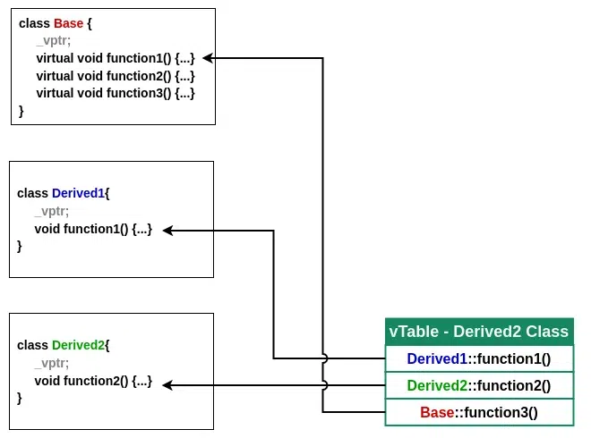
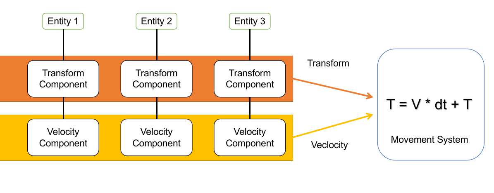

# (VERY EARLY DRAFT ONLY)

# Title: Unlocking Entity Component Systems in Game Engines: A Practical Approach to Core Mechanics

João Henrique Schmidt de Carvalho - 119050097

Advisor: Geraldo Xexeo

City: Rio de Janeiro

Univercity: Universidade Federal do Rio de Janeiro

## Abstract

This work explores the integration of Entity Component System (ECS) and scripting into game engine development, with a focus on their roles in enhancing performance, maintainability, modularity and coding complexity. ECS provides a data-driven approach to managing game entities and behaviors, addressing challenges related to memory locality, polymorphism overhead, and parallelism. Scripting facilitates both dynamic and static interaction with the engine, through Lua and C++ respectively, allowing greater accessibility when the ECS is unnecessary. This study analyzes the impact of ECS on core functionalities like graphics rendering and physics simulation. Key contributions include performance benchmarks, architectural insights, and practical guidelines for integrating ECS and scripting into game engines, with implications extending to simulation software and other performance-critical applications.

## 1. Introduction Scheme:

<!-- Problem presentation/Context -->

The creation of game engines is a complex task that involves integrating multiple systems, including graphics, physics, input handling, sound, events, and camera, to name just a few. One of the main architectural design choices of most modern game engines is the presence of ECS, which isolates each of those tasks into "Systems". These have access to all runtime data from the game. 

ECS is a data-driven architecture, which forbids object methods and instead strips its data into engine components whenever possible. Alongside ECS, scripting plays a role when those components can't be separated, and also enables dynamic interaction with interpreted languages, such as Python and Lua, among others. Both ECS and scripting allow for complex and simple game design choices, respectively, which is essential for handling modern games.

<!-- Objective -->

This TCC focuses on how these systems are built and their relationship with other engine components, mainly graphics and physics. The goal is to design and implement these systems within a game engine, providing a comparison with OOP of their impact on maintainability and then performance. Additionally, this work will explore how ECS and scripting can potentially influence other core systems, demonstrating their importance in the overall architecture of game engines.

<!-- Justification -->

The significance of this research lies in the growing need for modular and efficient game engines. ECS has become a widely adopted pattern in the industry due to its ability to handle large-scale projects by decoupling data from logic, id est, the entity-component from systems.

Scripting, meanwhile, allows game developers to still use OOP when necessary and allows them to quickly change gameplay without touching the engine code, with the added bonus, if the scripting language is interpreted, that it won't need to be compiled. In turn, it also makes it easier to apply modifications by non-core developers. Understanding how scripting interacts with the ECS API can provide valuable insights for improving engine performance because developers can decide when to pass script code into the engine code.

Meanwhile, even when not using such an architecture, it can be helpful to know why. For example, Godot programmers decided that the extra maintainability created more disadvantages than the extra performance was worth <cite>\[[7]\][7]</cite>. Therefore, it is a decision that must be made knowing its trade-offs.

<!-- Objective 2 -->

First, I will talk about references and other essential tools used when building the ECS for a game engine or other big C-based projects in general.

Then I will research and define the core architecture of ECS, identifying how entities, components, and systems will interact within the engine. This includes designing the data structures and memory layout.

Following that, I will briefly talk about two main sub-architectures.

Next, I will show an implementation of ECS, the Registry, and the Scene; the latter will act as a sort of API to manipulate complex data structures.

Finally, I will conduct performance benchmarks and tests to evaluate the efficiency and scalability of the ECS in handling big scenes, showing some examples of its interaction with other engine systems.

By the end of this project, I expect to have contributed a functional ECS and scripting system within Pain-Engine, which is a game engine I'm building as a hobby, documenting how these systems either improve or challenge existing architectures and developers' jobs. This TCC will serve as a practical guide for developers looking to integrate ECS and scripting into their own projects, offering insights into the design choices, trade-offs, and challenges associated with these core decisions.

## 2. Important Theoretical Frameworks

Computer Systems: A Programmer’s Perspective by Randal Bryant is sometimes called "The Computer Science Book" by some of my colleagues. This reference is key for understanding the lower-level assembly aspects of coding, which are critical when building high-performance and clean software. It covers topics like memory management, CPU architecture, instructions, unexpected behaviors and efficient code execution, all of which are relevant to optimizing queries inside ECS systems and their data structures.<cite>\[[1]\][1]</cite>

The detailed exploration of how instructions are decided by the compiler will help me make informed decisions when managing resources in the engine, ensuring that it remains both efficient and scalable. This book was especially helpful in addressing challenges related to safety problems, as it provides insights into what those problems are.

Another aspect of this book is that it covers some unintuitive and invisible behaviors from the C programming language that can lead to bugs, even for advanced programmers. By doing so, it justifies some of the design choices that I'm using in my game engine.

Another reference is the EnTT source code by skypjack. EnTT is a well-established and highly efficient C++ library for implementing a Sparse-Set Entity Component System (ECS). I chose to reference EnTT because it provides an already exhaustively tested ECS architecture that has been widely adopted in both hobbyist and professional game development, like Minecraft, Crimson Rush, ArcGIS Runtime SDKs, etc.<cite>\[[2]\][2]</cite> I also chose it because of his wonderful blog called "ECS back and forth", which goes into detail on what problems engines are usually trying to solve<cite>\[[8]\][8]</cite>. Studying EnTT's source code will expose some interesting ways to create functions to handle entities and components.

Its use of modern C++ techniques, like template meta-programming, will serve as a valuable guide for implementing similar strategies in my own Registry system. The library is also made with the intent of being very simple to use and to modify if necessary.

ECST is an experimental multithreaded compile-time ECS library. It was developed as a Computer Science graduation project. I chose to reference ECST for its interesting approach to compile-time and multithreaded designs. The library was made using C++14, but by studying ECST’s source code, one could gain knowledge to design an ECS that leverages modern C++20 architectures. <cite>\[[3]\][3]</cite>

Lastly, and perhaps the closest to the present article, is Sander Mertens's Flecs ECS library, which is also exhaustively tested on numerous projects like Tempest Rising, Territory Control 2, Resistance is Brutal, etc.<cite>\[[9]\][9]</cite> It is also complemented by the amazing blog series "Building an ECS". There, he discloses what designs and principles were chosen during his making of Flecs<cite>\[[10]\][10]</cite>, especially the main "Archetype" architecture, which differs from EnTT's Sparse-Set.

<!-- Description:
Description of the problem: Object Centric Loops
Description of the problem: 3 problems of OOP flexibility
The remedy: Enhancing System Centric Loops
What is the most common solution (done)
What is the problem with the common solution (done)
Explaining the ECS solution
What are the Components, the Entities and the Systems
What is the Registry
What are the archetypes
How does Scripting work?
-->

## 3.1 Description of the problem: Object-Centric Loops

There is no way around this subject other than to describe exactly what is being built here. As with any work, its purpose is to solve problems, or at least to solve them in a marginally better way than other existing solutions. To be more precise, there are 2 problems an ECS intends to solve for game engines: 

On the first problem, suppose that a developer is creating his/her game, and it needs to update millions of objects. Some of them are quite different from each other, so you have different structs of data.

For example, it might have objects like lights, meshes, audios, sprites, transforms, etc.

<!-- NOTE: this is pseudocode, "c" is here because i like highlight-->

```pseudocode
CLASS Mesh EXTENDS Node
CLASS Light EXTENDS Node
CLASS Audio EXTENDS Node
CLASS Sprite EXTENDS Node
CLASS Transform EXTENDS Node
```

Most probably, the object will be a combination of those above:

```pseudocode
CLASS MeshWithAudio EXTENDS Node 
  Mesh mesh
  Autio audio

CLASS LightWithAudio EXTENDS Node 
  Light mesh
  Autio audio

CLASS LightMeshWithAudio EXTENDS Node 
  Light light
  Mesh mesh
  Autio audio

CLASS CollisionWithMesh EXTENDS Node 
  Collider collider
  Mesh mesh
// etc
```

Or, if your language supports multiple inheritance, you can do the following:

```pseudocode
CLASS MeshWithAudio EXTENDS Mesh, Audio
CLASS LightWithAudio EXTENDS Light, Audio
CLASS LightMeshWithAudio EXTENDS Light, Mesh, Audio
CLASS CollisionWithSprite EXTENDS Collider, Sprite
// etc...
```
Either way, using those primary objects, you would need to make them available for the developer, so they can be used on actual objects, e.g.:

```pseudocode
CLASS Enemy EXTENDS ColliderSpriteWithAudio
CLASS Player EXTENDS ColliderSpriteWithAudio
CLASS Firefly EXTENDS LightWithAudio 
CLASS Lamp EXTENDS LightMeshAudioCollider
CLASS Wall EXTENDS CollisionWithSprite
```

Therefore, you would need to define $2^N$ different classes, which is not feasible for higher values of $N$. Let's explore how Godot, which is an exclusively OOP engine, solves this problem inside their definition of `Node` at `scene/main/node.h` <cite>\[[11]\][11]</cite>:


<!-- 1. polymorphism overhead, 2. memory locality, 3. parallelizability-->
```cpp
class Node : public Object {
  struct Data {
    Node *parent = nullptr;
    Node *owner = nullptr;
    HashMap<StringName, Node *> children;
  };
  Data data;
};
```

Now, the problem is solved by using composition and trees, without using multiple inheritance. From Godot's perspective, you can place new components inside its children hashmap, and as long as it inherits from Node, you will have your object as complex as necessary.

```cpp
Node enemy = new Node();
enemy.data.children.insert({"Mesh", new Mesh{}}, {"Audio", new Audio});
```
Now, if we were to add an interpreted language, we could expose a function such as `insert_component` to add new components to objects inside the engine, without needing to recompile.

With that ready, the developer also needs to iterate through all those objects and update their data. Each object will have at least some sort of action in the game, for example, be rendered, collide, process events, move, change states, etc.

Those direct approaches are prone to creating two specific code styles to fill those tasks: a vertical style that is object-centric (OC) and a more horizontal style that is system-centric (SC).

In the vertical style, each object is called and sequentially updated to perform specific tasks:

```pseudocode
FOR EACH enemy IN Enemies
  enemy.move()
  enemy.checkCollisions()
  enemy.render()
  enemy.searchPlayer()
  // etc

FOR EACH player IN Players
  player.move()
  player.checkCollisions()
  player.render()
  // etc

FOR EACH lamp IN Lamps
  lamp.checkCollisions()
  lamp.render()
  // etc

FOR EACH firefly IN Fireflies
  firefly.move()
  firefly.render()
  // etc
```

A little problem emerges: in this example, enemies execute first, meaning they can move and collide with the player first. But in another simulation, if the player executes first, then it can run before getting hit.

Notice, however, that many of those functions are performing the same task for many different objects. So in OOP, we can solve the problem by using interfaces to our advantage:

```pseudocode
INTERFACE i_move IMPLEMENTS move
INTERFACE i_render IMPLEMENTS render
INTERFACE i_collidable IMPLEMENTS checkCollisions

CLASS Enemy IMPLEMENTS i_move, i_collidable, i_render
CLASS Player IMPLEMENTS i_move, i_collidable, i_render
CLASS Lamp IMPLEMENTS i_collidable, i_render
CLASS Firefly IMPLEMENTS i_move, i_render

// ...later
movables.add(NEW Enemy(), NEW Player(), NEW Firefly())
renderables.add(NEW Enemy(), NEW Player(), NEW Lamp(), NEW Firefly())
collidable.add(NEW Enemy(), NEW Player(), NEW Lamp())

FOR EACH movable IN movables
  (i_move) movable.move()
FOR EACH renderable IN renderables
  (i_render) renderable.render()
FOR EACH collider IN collidable
  (i_collidable) collider.checkCollisions()
```

Why is this necessary? Mainly because it can happen that one operation conceptually needs to happen for all objects before another operation begins. Now enemies need to make their moves before checking their collisions, solving that little problem.

This is an SC loop but not an ECS yet. This specific style, which is common in OOP, still has 3 performance issues.

## 3.2 Description of the problem: 3 problems of OOP flexibility 
<!-- 1. polymorphism overhead -->

The first one is polymorphism overhead. Dynamic polymorphism in typical OOP implementations commonly uses an indirect dispatch mechanism. Why? Because whenever you call a method of a base class or use interfaces, the call itself involves one indirect step before the actual code is reached, and this redirection creates the overhead. Its cost usually depends on the implementation; C++ usually does this with the use of vTables, which are very straightforward indexed tables that link virtual functions to real functions.
But what is the overhead? At runtime, the program needs to check inside the vTable what is the correct link between the virtual function and the actual function before performing the call. That extra step is what makes the program slow down<cite>\[[6]\][6]</cite>.



*Figure 1: Example of vTable storing the linkage between two derived classes*

It's designed this way on purpose. For example, both enemies and fireflies implement a move function, but the firefly function may not necessarily be the same as the enemy function, since flies usually move on 3 axes, including up and down. Interfaces, therefore, also allow you to modify the function bodies per class at the cost of a little memory and CPU.

<!-- 2. Memory locality -->

The second problem is memory locality. In the ECS case, the data will always be stored in a data structure of your choice, like an array or a map. Since you have the option to store all data in a single pool, you might as well store it in a contiguous section of your memory.  

However, when iterating in OOP, you are looping through the data of the entire object first before going to the next object. If such an object has different members that aren't being used in the function, your instruction will have to skip them. 

It is possible to clearly see the cost by doing a simple test. For example, we can write a small loop to sum all elements of a matrix "A":

```pseudocode
result = 0
A = Matrix(20000,20000)

FOR EACH i from 0 to A.rows - 1:
  FOR EACH j FROM 0 TO A.cols - 1:
    ADD A[i][j] TO result
```

When implemented in C, this code will execute in 1.78 seconds for a square matrix A of size $20000$.
```pseudocode
result = 0
A = Matrix(20000,20000)

FOR EACH j FROM 0 TO A.cols - 1:
  FOR EACH i from 0 to A.rows - 1:
    ADD A[i][j] TO result
```
When implemented in C, this code will execute in 2.23 seconds for a square matrix A of size $20000$, a 25% increase.

| Event                   | Row-wise    | Column-wise   |
| ----------------------- | ----------- | ------------- |
| `cache-references`      | 30,372,176  | 1,112,805,176 |
| `cache-misses`          | 8,309,155   | 145,684,680   |
| `L1-dcache-loads`       | 400,318,697 | 400,318,545   |
| `L1-dcache-load-misses` | 31,877,377  | 693,496,164   |
| `LLC-loads`             | 17,335      | 556,326,496   |
| `LLC-load-misses`       | 6,775       | 33,935,569    |

*Table: `perf stat` counters for both traversals of the $20000 \times 20000$ matrix, mean of 5 runs on an Intel i5-1135G7. The counts cover the whole program, including the sequential loop that fills the matrix.*

What is happening here? In the memory, the data for matrix A is stored in the following layout:

```pseudocode
A[0][0], A[0][1], A[0][2], ..., A[0][N], A[1][0], ..., A[1][N], ..., A[N][N]
```

When the CPU reads memory, it generally does not fetch just the 4-byte float like we requested. It fetches a cache line, typically something like 64 bytes on modern CPUs. So, when requesting:

```pseudocode
A[0][0], A[0][1], A[0][2], A[0][3], A[0][4], A[0][5], A[0][6], A[0][7], A[0][8], ...
```

The CPU can request the next number from its own cache instead of fetching again.

If we choose not to do it, we are essentially jumping $20000$ bytes of integers for every single iteration, and this increases the cache misses we see with the perf command. In the end, this just shows what is already known: it is better for the CPU if the loops operate on arrays that are contiguous in memory.

With this, we conclude the two disadvantages of not using an ECS style to deal with objects in a simulation.

However, there is a third, very indirect problem: the difficulty of implementing parallelism when compared to ECS. To be more precise, the work needed to parallelize ECS systems is smaller than in OOP cases because of the restrictions it imposes. 

I will talk more about this when discussing systems, but to make a brief introduction as to why: the main problem with parallelization is finding units of processing which don't share any data, but because data in ECSs is often iterated mostly with the same set of components, there is a guarantee that the data inside a single system is unrelated to each other, which allows easy concurrency. 

<!-- possible comparasions with cuda :
GPU programming	vs ECS
Kernel vs	System
Thread vs	Entity / query iteration
Global memory	vs Component storage
Thread block vs	Chunk / archetype
Grid vs	Entire query
Kernel dispatch	vs System execution
Kernel arguments vs	Query/resources
Synchronization	System vs ordering/dependencies
-->

## 4.1 ECS as a remedy: System
 
The previous OOP SC loop also allows for further flexibility when it comes to completing engine tasks. For example:

```pseudocode
CLASS Firefly IMPLEMENTS i_move, i_render
  FUNCTION move OVERRIDE
    // move firefly ...
  // ... rest of the class

CLASS Enemy IMPLEMENTS i_move, i_collidable, i_render
  FUNCTION move OVERRIDE
    // move enemy ...
  // ... rest of the class
```

This is a useful flexibility to have, but it's also probable that the developer will implement some repeated calculations. For example, let's suppose a very simple firefly would use 5 members:

```pseudocode
CLASS Firefly IMPLEMENTS i_move, i_render 
  position = (0,0)
  velocity = (0,0)
  intensity = 1
  timer = 0.0

  FUNCTION move(dt) OVERRIDE 
    timer -= dt

    // Choose random dir
    IF directionTimer <= 0.0f THEN
      velocity.x = getRandomNum()
      velocity.y = getRandomNum()
      timer = getRandomNum()

    // Apply velocity !
    position += velocity * dt

  FUNCTION render OVERRIDE
    // draw light
  // ... rest of the class
```
Similarly, a very simple enemy that just follows the player would also need to apply both position and velocity, alongside other members:

```pseudocode
CLASS Enemy IMPLEMENTS i_move, i_collidable, i_render 
  position = (0,0)
  velocity = (0,0)
  collider = (1,1)
  speed = 1
  sprite = { TYPE::SQUARE, (1,1) }
  material = { "Texture.glsl", 0xFFFFFF }

  FUNCTION move(float dt) OVERRIDE
    direction = (0,0)

    // player dir
    direction = pathToPlayer()
    velocity = direction * speed;
    
    // Apply velocity !
    position += velocity * dt;

  FUNCTION checkCollisions OVERRIDE
    // collide with other colliders
  FUNCTION render OVERRIDE
    // draw sprite and material
  // ... rest of the class
```

The existence of an SC loop is already known by us. Since they are both using the same Euler formula, the formula itself can be moved to the SC loop:

```pseudocode
FUNCTION applyVelocity(positions, velocities, dt)
  FOR EACH (position, velocity) IN ZIP(positions, velocities)
    position += velocity * dt
```

Doing so means the engine is running the behavior separately from the data, and this is correct. Systems are just code blocks that transform data; each of them is a function that represents specific logic, like applying velocity.

However, a new problem emerges: when we try to create a system like `applyVelocity`, the underlying data isn't yet organized into convenient variables like `positions` and `velocities`. They are, instead, owned by each object as member variables. 

The solution is just to separate them, removing the ownership of their respective objects and instead putting them in a contiguous block of memory. For example, suppose we have one firefly and one enemy:

```pseudocode
velocities = [(0,0), (0,0)]
positions = [(0,0), (0,0)]
```

The system now has everything to work, meaning it can now be called and, therefore, perform its tasks. However, we quickly need to compensate for removing the ownership from both objects:

```pseudocode
CLASS Firefly IMPLEMENTS i_move 
  row = 0
  intensity = 1
  timer = 0.0

  PUBLIC FUNCTION move(dt) OVERRIDE 
    velocity = velocities[row] // now retrieving from outside ownership
    timer -= dt

    // Choose random dir
    IF directionTimer <= 0.0f THEN
      velocity.x = getRandomNum()
      velocity.y = getRandomNum()
      timer = getRandomNum()
    // No need to apply velocity to position

  // ... rest of the class
CLASS Enemy IMPLEMENTS i_move, i_collidable, i_render 
  row = 1
  collider = (1,1)
  speed = 1
  sprite = { TYPE::SQUARE, (1,1) }
  material = { "Texture.glsl", 0xFFFFFF }

  PUBLIC FUNCTION move(float dt) OVERRIDE
    velocity = velocities[row] // now retrieving from outside ownership
    direction = (0,0)

    // player dir
    direction = pathToPlayer()
    velocity = direction * speed;

    // No need to apply velocity to position

  // ... rest of the class
```


For small-scale simulations where the number of objects is small, this setup can be slower since we are also calling a third extra function just to run two calculations that were going to be done anyway. However, we are not interested in small simulations because those tend to already be performant anyway.

By only making this change, we already achieve a very crude ECS. Specific components of those objects (position, velocity) are separated, but they are also contiguous inside memory. This means they make better use of the CPU cache. As the number of objects increases, the advantages in performance are sure to follow.

The downside is that we are not allowed to override a system function, since it's just a static function. So if we need to make some task that is too complicated, we will inevitably add more if branches to it. An example of this can be seen inside the render system that will be shown later. 

Notice, however, it still has OOP elements in it, which is the polymorphism on methods like `move`, `render`, `checkCollision`, etc. That is completely fine, since ECS also allows those elements by including a scripting system. 

With all this, let's see the ECS design for the engine tasks by creating different Systems:

```pseudocode
// interface functions
FOR EACH movable IN movables
  (i_move) movable.move()
FOR EACH renderable IN renderables
  (i_render) renderable.render()
FOR EACH collider IN collidable
  (i_collidable) collider.checkCollisions()

// movement system (already seen)
FOR EACH movementComponent, transformComponent IN movements, transforms
  // move

// collisions system
FOR EACH collisionComponent, movementComponent, transformComponent IN colliders, movements, transforms
  // check collisions

// render system 
FOR EACH materialComponent, spriteComponent IN materials, sprites
  // render

// etc...
```



*Figure 2: Movement System performs a scalar multiplication and a sum in two vectors*

Using that, we solve memory locality, since the components are now close together in memory, but we still have the polymorphism overhead, because each system function still precedes an interface function. One way to solve this is to create more and more SC functions, until the entire object update is performed by systems.

Even if that isn't possible, since they will all use contiguous memory, they are at minimum still performing faster even if we include interfaces.

But how do we create more systems? As a rule of thumb, the code inside each loop is generally very specific, because its purpose is to update a very broad range of objects with a well-defined task. For example: 

- A Movement/Kinetic System updates positions based on velocities
- A Collision System calculates the intersection between collision boxes
- A Render System handles filling the batch rendering buffer
- Lifetime System decrements timers and removes entities when their lifetime expires
- Particle System updates particle positions, velocities, colors, and lifetimes of swarms
- UI System updates UI elements based on application or gameplay state.
- Event System dispatches and processes gameplay functions between objects
- AI System updates decision-making, behavior trees, paths, or state machines
- Scripting System executes scripts attached to objects for everything else
- _etc_

The process of creating them follows the same principle of an optimization flowchart: if any function proves to be a source of constant bottlenecks, then moving the loop from OC to SC becomes more attractive. 

<!-- consider talking about parallelism here -->


### 4.2 ECS as a remedy: Components

When expanding an object, we can expand its methods through polymorphism. However, the same isn't true for its data definition, which is always entirely copied to the derived class. This means that the changes made to the firefly and enemy examples are just different models of basic ownership: our model entirely moves members into dedicated data structures, and this decision is completely orthogonal to OOP.

Previously, there were only 2 objects, both with 1 set of components:
```pseudocode
velocities = [(0,0), (0,0)]
positions = [(0,0), (0,0)]
```
However, our example was too shallow; it didn't show what to do when classes with different components are at play. 

To make this concrete, let's go back to our modified classes that were left over from the OOP hierarchy: `Enemy` and `Firefly`. On a whim, the developer also included a `Wall`, our third object.


We haven't touched the other members until now, and our objective is to move the maximum amount of members into contiguous memory, as well as to remove functions that are already in the system. So let's do that.

```pseudocode
CLASS Enemy IMPLEMENTS i_move
  row = 1
  speed = 1
  sprite = {}

  PUBLIC FUNCTION move OVERRIDE
    // still needs speed for the velocity module

  // ... rest of the class

CLASS Firefly IMPLEMENTS i_move
  row = 0
  timer = 0.0

  PUBLIC FUNCTION move(dt) OVERRIDE 
    // still needs timer

  // ... rest of the class

CLASS Wall
  row = 2


velocities = [(0,0), (0,0), NULL]
positions = [(0,0), (0,0), (0,0)]
collider = [NULL, (1,1), (1,1)] 
material = [NULL, {"Texture.glsl", 0xFFFFFF }, {"Texture.glsl", 0xAA11FF}]
sprite = [NULL, {TYPE::SQUARE, (1,1)}, {TYPE::RECT, (1,1)}] 
light = [{intensity = 1}, NULL, NULL] // firefly light component was transported
```


We are starting to create a matrix of components. If 100 of each were initialized, they would generate the following matrix:


*Figure 3: Matrix of objects and their components, filled with arbitrary data*

There are two main problems. The first is that representing components as a matrix indexed by entity obligates each component array to reserve space for every entity, even when most entities do not possess that component. This creates sparse data structures: iterating over a component requires either checking for missing components or traversing unused entries, while memory is also consumed by slots that contain no component at all.

"How to solve" this problem is the question for the next 3 chapters and the core of ECS development and discussions. But first, the natural first step is to allow systems to select sets of components.


Why? Because Systems interact with the engine by asking for specific queries. Each should ask the ECS library what components it wants to iterate with. Inferring this logic, it is expected that each system has a yes/no decision for every component, meaning it is possible to use bitmask logic with it, something that CPUs happen to handle very well.

To do this, we can associate every component with a base 2 ID:

```pseudocode
CLASS TransformComponent   // { (0,0), 0.0, (1,1) } position, rotation, scale
  STATIC id = 1
CLASS VelocityComponent   // { (0,0) } linear velocity
  STATIC id = 2
CLASS SpriteComponent     // { (0,1), (32,32) } texture rect, size
  STATIC id = 4
CLASS MeshComponent       // { "cube", "brick" } mesh handle, material
  STATIC id = 8
CLASS LightComponent      // { (1,0.9,0.7), 1.0, true } color, intensity, enabled
  STATIC id = 16
CLASS ColliderComponent   // { (16,16), false } half extents, isTrigger
  STATIC id = 32
CLASS AudioComponent      // { "step.wav", 1.0 } clip handle, volume
  STATIC id = 64
CLASS MaterialComponent     // { "Texture.glsl", 0xFFFFFF }, shader, color
  STATIC id = 128
// etc...
```

Therefore, querying the correct component is now simply a matter of using the bitmask `OR` operator, allowing us to properly define the vectors `movements`, `transforms`, `sprites`, etc. From the last example:

```pseudocode
FUNCTION query(Components...)
  bitMask = 0
  FOR EACH Component IN Components
    bitMask = bitmask | Component.id
  
  selectedVectors = {}
  FOR EACH vector IN componentVectors
    IF vector.mask & bitMask == bitMask THEN
       selectedVectors = selectedVectors + [vector]
  RETURN selectedVectors


// ... later in the systems section:
movements, positions = query(TransformComponent.id, VelocityComponent.id)
FOR EACH movementComponent, transformComponent IN movements, positions
    // move
```

The query function now allows us to filter specific components that we want. `componentVectors` isn't defined yet, but that is on purpose. In the future, we also need to worry about accessing specific members without using `query`.

> image here

<!-- maybe an image here? -->


### 4.3 ECS as a remedy: Entity

Why? Because not everything can be accessed and processed using systems and queries: highly specific functions like the firefly's random movement and the enemy's following of the player still need to be processed in an OC loop. Or at least, we don't know if they will become their own systems, which means a good architecture will allow both options to the developer.

Previously, we accessed the component in an OC way by using `velocity = velocities[row]`; however, there is no guarantee that `row` will always be the correct memory address, specifically because we might need to change the order, remove, and break memory into different chunks when implementing an ECS.

One solution is to just create a second new reference table that maps all real objects to their respective rows. The underlying ECS registry will then take care of guaranteeing a correct map. Each object will have its own identification, which we call "entity".

"Entity" has a really simple definition: it's an integer.

| Entity | 0 | 1 | 2 | 3 | $\cdots$ |
|--------|-----|-----|-----|-----|-----|
| Row | 12 | 3 | 8 | 15 |$\cdots$|

If we implement this into a map, we just need to make two redirections to access the underlying data: 

```
// NOTE: not the end function
FUNCTION get(component, entity)
  CONST row = map[entity] // first redirection
  RETURN component[row] // second redirection
```

As a benefit, we also have an immutable, reserved identification that can be used on any object, which allows for easy debugging. Meanwhile, the ECS can manipulate any row it wants behind the scenes while keeping the entities intact.

There are different views on what constitutes an entity or what it's supposed to represent. For example, if you search on Wikipedia for ECS, you will find "Entity" defined as a general-purpose object, id est, a game object. Some articles on Medium also define it that way. In contrast, the Entity Systems Wiki defines it as a container to which components can be added. 
I, however, decided to go with the definition used by Unity Engine, which states that entities are just indices that represent object IDs. 

The reason to prefer this definition is that it's closer to the usual implementations, which use it as an ID.

As you can guess from the definitions of components, entities and rows, the insides of ECSs are usually stored inside flexible data structures like vectors, maps, unordered maps, etc. The engine needs that flexibility to maximize the contiguous memory while avoiding creating unused memory.

To achieve this, it is possible to create a separate layer, usually called "registry", which will own all the runtime data from the engine. As a didactic strategy, it can be compared to application programming interfaces (APIs). 


### 4.4 ECS as a remedy: Registry


An API is a set of rules and protocols that allows different software to communicate data between themselves automatically, usually into a common database but also largely used in multi-service setups. In the same way, the ECS registry is an "API" that allows the engine to communicate with the ECS, except that it is almost always built in a static library once for performance reasons.

Two important routes have already been shown. The first is the `query` function, which allows the engine to access contiguous memory. The second is the `get(component,entity)` function, which allows script-like functions to occasionally access specific data from a specific entity. Both can be used as view-only or allow modifications, e.g.: C++ and Rust allow const and mut logic, respectively.

As previously stated, the registry can be responsible for:
- Retrieving the iterator, which allows us to query components in contiguous memory
- Getting a specific component for a given ID, which allows OC scripts to function

Going a little deeper inside the code, it can also do the following:
- Create new entity IDs and recycle destroyed IDs.
- Batch emplace new components for new IDs
- Remove IDs and their indexed components
- Check if a component exists for a given ID
- Rarely, add new components to existing IDs
- Very rarely, remove components from existing IDs

Registries are hard to program because they are accessed almost every time, making them very performance-critical. They usually require different template-specific code to be able to run as cleanly as possible, making the developer's interaction with the registry feel as if it isn't even there.

### 4.5 ECS as a remedy: Archetype Registries

With the registry being built, we can now start to talk about Archetypes. 

The problem is, we need alternatives against the use of a single matrix, but notice that when we had only `position` and `velocity`, our matrix was perfectly used. Why? Because both components were the only ones that existed and both classes, Firefly and Enemy, only used those components. However, when we added more components to the engine, that was no longer the case.

The answer seems simple then: for entities that use the same components, we can create dedicated, smaller matrices that don't have any unused memory. If we have $N$ classes in the game, and every class can use a different set of components, it means that we have a maximum of $N$ matrices.

Games, however, have an extensive demand for different classes, meaning that at some point, some of them will inevitably use the same set of components, which in turn, will make the registry use fewer than $N$ matrices.

For example, consider an environment with rocks, walls, trees, and power poles. They can create this scenery with common components like transform, material, collision and meshes. And the developer might not need to create different functions to deal with each.


*Matrix 1: walls, trees and power poles with arbitrary values*

Now, if we add a more complex object, like a moving car that needs a moving component:


*Matrix 2: cars with arbitrary values*

And that's it, meaning objects with the same components are part of the same archetype. If we add moving rocks, those will be in the same archetype as cars.

These smaller, 100% filled matrices are called "archetypes". They allow objects with the same set of components to be in the same matrix:

```
CLASS Archetype
    componentMap : MAP<ComponentType, Array>  // one SoA array per component type, equivalent to a matrix
    entities     : ARRAY<Entity>              // row ids, kept in sync with the arrays above
    removers     : ARRAY<Function(Row)>    // swap-and-pop routine for each component type
```


Why `removers`? ECSs are performance tools, so most likely they will be implemented in a strongly typed language. The problem is that creating an array inside componentMap will result in type erasure, meaning the program will lose the original context it used to construct it. In C++, this happens when you use `(void *)`.

This is fine for reading and modifying since the functions for that will always specify which component they want. But the same isn't true for removal functions since they will either remove a specific entity or the entire archetype, without mentioning context, e.g.:

```
registry.createComponent(componentType)
registry.getComponent(ComponentType, entity)
registry.query(ComponentType1, ComponentType2, ..., ComponentTypeN)
registry.remove(entity) // developer doesn't specify component
```

The most straightforward solution is to store the type, and therefore the memory size, of the component you want to delete, into a function that will do just that for you. 

Now it's just a matter of completing the other responsibilities with specific functions:

```
// Finds the array of a component type, creating it (and its remover) on first use
FUNCTION Archetype.createComponent(componentType)
    IF componentMap CONTAINS componentType THEN
        RETURN componentMap[componentType]

    array = NEW Array()
    componentMap[componentType] = array
    removers.APPEND(FUNCTION(row) = removeFromComponent(componentType, row))
    RETURN array
```

Insertion usually goes the same way as with any vector: after retrieving the correct vector, you append the necessary components.

```
FUNCTION Archetype.push(componentType, componentValue)
    array = createComponent(componentType)
    row = array.size // the row is the current length, taken before the append
    array.append(componentValue)
    RETURN row

// NOTE: you can make this function public, while keeping individuals push private
FUNCTION Archetype.push(entity, components)
    FOR EACH (componentType, componentValue) IN components DO
        row = pushComponent(componentType, componentValue)
    entities.append(entity)
    RETURN row
```

Similarly, you can get any individual component inside the archetype by retrieving its vector first:

```
FUNCTION Archetype.getComponent(componentType)
    ASSERT(componentMap CONTAINS componentType, "Missing component type: " + componentType)
    RETURN componentMap[componentType]

```
And later use it to retrieve the row:
```
// Raw access to one component of one row, with the bounds check the engine needs
FUNCTION Archetype.fetchComponent(componentType, row)
    array = getComponent(componentType)
    ASSERT row < array.size
    RETURN array[row]
```


There are many ways to remove a specific component; here is the strategy of swapping with the last element, then decreasing the vector size.
```
FUNCTION Archetype.removeFromComponent(componentType, row)
    array = componentMap[componentType]
    SWAP array[row], array[array.size - 1]
    array.pop()
```

This function is used here to delete an entire entity, alongside all its components. 
Since the row has changed, you need to update the entity-row map from section 4.3, hence the return:

```
FUNCTION Archetype.remove(row)
    swappedEntity = entities[entities.size - 1]

    FOR EACH remover IN removers DO
        removeFromComponent(row)

    SWAP entities[row], entities[entities.size - 1]
    entities.pop()
    RETURN swappedEntity
```


### 4.7 Explaining the ECS method: Scripting

After reviewing the ECS, one might wonder how difficult it would be to replace the traditional object-oriented approach entirely with the ECS approach. After all, to implement everything using systems, developers must abstract behaviors across different entities rather than defining them individually for each object.

This is where scripting comes in to help. For parts of the code that aren't critical, you can more safely use object-centric styles too. 

It is a slower, but easier and more flexible approach that abstracts many specifications of your engine. That way, game and mod developers can quickly script what they want, without diving into the engine code and without compiling! But you can also compile if you choose to.

Consider, for example, an NPC that follows the player. Its movement could be implemented as a dedicated system, but its decision-making process might involve several conditions, timers, random choices, dialogue, and other specific rules. Implementing all these behaviors through generic systems because of a single different entity could introduce unnecessary complexity.

Instead, we can attach a script to an entity and allow it to interact with the ECS through the Registry API. This provides a middle ground between the two approaches: the engine retains the performance advantages of ECS for common operations, while developers preserve the flexibility of object-oriented programming when necessary.

How? Just create a special component that holds a single pointer and put your object-specific scripts there. That pointer points to an Entity ID, which can be used to access the components later, using the fetchComponent function.

Continuing with the example of the car from earlier, assume an arbitrary example declared without an ECS:


*Figure 3: Car struct and an equivalent archetype*

To transition to the ECS, the developer must plan for its members to be replaced by components:


*Figure 4: Moving the members into an archetype* 

We are left with specific members `break` and `transmission`. Assuming there are only very few moving cars in the game, the developer might not want to create a component just to be used in a single case. For that, the engine can use a special `Script Component` with a simple base class:

```
CLASS Scriptable
  entity = -1

CLASS ScriptComponent
  scriptable : Scriptable *
```
The specific members can then be inherited:

```
CLASS Car EXTENDS Scriptable
  break = NULL
  transmission = NULL
```

They can then be accessed by simple casting.


*Figure 5: Moving the members into an archetype* 


It's not uncommon for game engines to use runtime functions as described in the 8th chapter of `Game Engine Architecture`: the game's root loop will iterate `updateSceneElements` and `renderScene` functions. Those can be executed at different frequencies, especially if FPS is locked or if the elements need more time to process. However, there is no rule forbidding components to reference equivalent functions:

```
CLASS ScriptComponent
  scriptable : Scriptable *
  updateSceneElements : FUNCTION* 
  renderScene : FUNCTION* 

// later in the game loop
FUNCTION updateSceneElements()
  FOR EACH script IN registry.query(ScriptComponent.id)
    script.updateSceneElements()

// later in the render loop
FUNCTION renderScene()
  FOR EACH script IN registry.query(ScriptComponent.id)
    script.renderScene()
```


Because the Scriptable holds the entity ID, it can access all its original members, but as components. 


Looking back to the registry, it's possible to define a new function responsible for retrieving any set of components from the entity:

```
FUNCTION Archetype.extractRow(componentTypes, row)
    row = NEW Tuple()
    FOR EACH componentType IN componentTypes DO
        row.append(fetchComponent(componentType, row))
    RETURN row
```

Since it will be used in very small cases, it might actually be faster than using the ECS system as it doesn't need to prepare the query beforehand.


This solution is often used together with a scripting language, which also abstracts C++ into a simpler and friendlier language, such as Python, Lua, C#, JavaScript, etc.


## 5 Results:

<!--
I will create some simulations/games to fully explore the expected result scenes.
For performance considerations to have an impact, they need cases to work with.
Only after that I can start to fully optimize all sections of the problem.

The expected results will be a visible increase in performance, well defined and separated systems, performant scripting compared to fully compiled languages like c# and c++ and a performat registry equivalent or better than Entt or similar projects.
-->

To fully explore and validate the expected results, I designed simulations that stress-test my game engine. These tests serve both to highlight its capabilities and to identify areas for optimization. Performance considerations will be emphasized, requiring scenarios where computational efficiency has a significant impact. 

The expected outcomes include:  
- A measurable increase in performance compared to baseline implementations.  
- Clearly defined and modular systems benefiting from ECS, with increasing levels of memory layout
- A scripting system that is performant when compared to traditional OOP styles
- A robust registry system that doesn't slow down on query calls

### 5.1 Tests:
To achieve these results, I implemented and tested my engine using the following scenarios:  
<!-- - **AI Battle Simulation:** Create a clone of the Pezza [AI battle simulation](https://www.youtube.com/watch?v=f_HwyDfvCZQ), where multiple AI agents interact in real-time. This will stress-test the ECS, scripting, and real-time decision-making systems.  -->
- **Big Entities Scene:** Design a small scene with an increasing number of particles and objects, to intentionally push the system to its limits.
- **Memory Size Test:** Design a small scene with a fixed number of particles and objects, then intentionally increase the memory size of each struct.
- **Particle Simulations:** Implement simulations involving water or numerous colliding particles, scenarios commonly found in physics-heavy games. This will validate the engine’s physics system and its ability to handle numerous calculations efficiently.  

Every test was built with object and archetype versions, compiled at -O2, and run for 300 frames. The wall time of each corresponding scope was then retrieved.

I report the median and quartiles per frame, plus the ratio Object / Archetype in a table, so a value above 1 means the Archetype version is faster. The tests ran on an 11th Gen Intel i5-1135G7, 24GiB of RAM, kernel 7.2.11-arch1-1, and Clang 23.1.3. Plot scripts and raw tables are in `tcc/tests/`.


### 5.2 Big Entities Scene

This is a synthetic test with nothing moving or rendered. Each entity holds 1 KiB in four 256-byte components, and the count doubles from 1024 to 131072. Two read-only passes run each frame: `readHot` sums one component, and `readAll` sums all four. Both versions run the same summing loop, and the sums must match.

`readHot` was 2.08 to 2.80 times slower in the Object version at every entity count. `readAll` was 1.09 to 1.19 times slower, except for one outlier at 65536 entities (0.79). The cost of the layout therefore depends on how much of the entity a pass reads.


*Figure 6: Big Entities, time per frame reading one component of each entity*


*Figure 7: Big Entities, time per frame reading all components of each entity*

### 5.3 Memory Size Test
The entity count is fixed at 100000 and each round adds a 256-byte struct, from 1 to 12 (256 B to 3072 B per entity). `readHot` always reads one struct, so the bytes read stay constant while the bytes stored grow. `readAll` reads every struct.

With one struct, both layouts are equivalent, and `readHot` measured 2699 us in both, a useful sanity check. With 12 structs, Object took 5155 us against 1652 us for Archetype (3.12x). `readAll` shows no clear advantage up to 4 structs (0.84 – 1.02) and 1.13 – 1.51x from 5 structs on.


*Figure 8: Memory Size, time per frame reading one struct of each entity*


*Figure 9: Memory Size, time per frame reading all structs of each entity*

### 5.4 Particle Simulation

A realistic scene: between 100 and 2000 asteroids move, collide with each other and with four walls, and are rendered. Initial positions and velocities come from the same seed in both versions. Collision detection is naive and O(n²).

Layout made no meaningful difference in this scene, and Object kinematics was slightly faster at low counts. Each entity is small and the systems read most of it, so the Object version wastes little cache.

Collision also dominates the frame regardless of layout. At 2000 asteroids, collision alone takes about 22 ms, way above the 16.67 ms budget of a 60 Hz frame, so the simulation no longer holds real time.
As stated before, `updateSceneElements` and `renderScene` run at different frequencies, so at 22 ms, render is almost never called.


*Figure 10: Particle Simulation, collision detection time per frame*


*Figure 11: Particle Simulation, kinematics time per frame*


*Figure 12: Particle Simulation, Render2d time per frame*

### 5.5 Threats to validity

 - Results come from one machine and 300 frames per configuration.
 - The frame limit lets the CPU idle between frames, so clock changes may affect the absolute times. <!--Remove or update after rerunning.-->
 - `readHot` always runs before `readAll`, so the second pass may benefit from the cache state left by the first.
 - Only Object and Archetype were compared. Sparse-set and other engines remain future work.

### 5.6 Conclusion

While game engines are never truly “finished,” the goal is to push the boundaries of what most general-purpose engines achieve within the defined scope of this project. By iterating on each of these tests and striving to exceed or match the benchmarks of existing engines, I aim to demonstrate the robustness and performance of ECS. These efforts will also provide a foundation for future comparisons, like the Sparse-Set Registry.

## References

[1] R. E. Bryant and D. R. O’Hallaron, Computer systems: a programmer’s perspective, 2. ed. Boston, Mass.: Prentice Hall, 2011.

[2] M. Caini, skypjack/entt. (Oct. 23, 2024). C++. Accessed: Oct. 23, 2024. [Online]. Available: https://github.com/skypjack/entt

[3] V. Romeo, vittorioromeo/ecst. (Oct. 23, 2024). C++. Accessed: Oct. 23, 2024. [Online]. Available: https://github.com/vittorioromeo/ecst

[6] K. Driesen and U. Hölzle, “The direct cost of virtual function calls in C++,” SIGPLAN Not., vol. 31, no. 10, pp. 306–323, Oct. 1996, doi: 10.1145/236338.236369.

[7] J. Linietsky, “Why isn’t Godot an ECS-based game engine?,” Godot Engine, Feb. 26, 2021. [Online]. Available: https://godotengine.org/article/why-isnt-godot-ecs-based-game-engine/

[8] M. Caini, “ECS back and forth: Part 1 – Introduction,” skypjack on software, Feb. 14, 2019. [Online]. Available: https://skypjack.github.io/2019-02-14-ecs-baf-part-1/

[9] S. Mertens, Flecs: A Fast Entity Component System (ECS) for C & C++. GitHub. [Online]. Available: https://github.com/sandermertens/flecs

[10] S. Mertens, “Building an ECS #1: Where are my Entities and Components,” Medium, Aug. 6, 2022. [Online]. Available: https://ajmmertens.medium.com/building-an-ecs-1-where-are-my-entities-and-components-63d07c7da742

[11] Godot Engine Contributors, “Node class definition (node.h),” Godot Engine, GitHub. [Online]. Available: https://github.com/godotengine/godot/blob/master/scene/main/node.h
